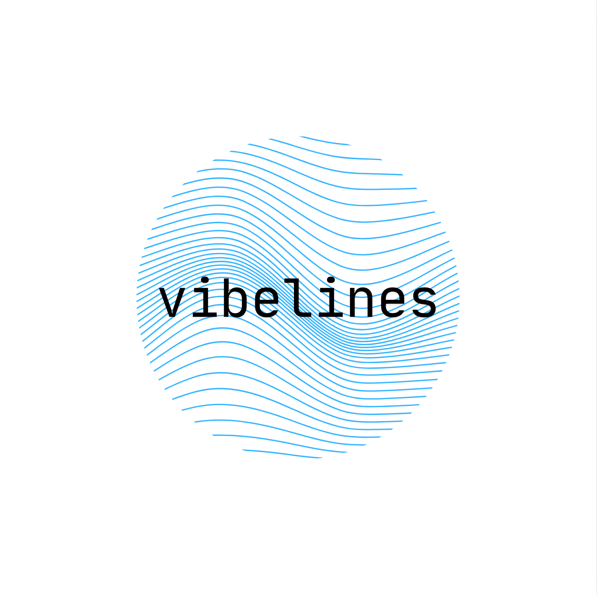

<!-- PROJECT LOGO -->
 

  

  <h3 align="center">Vibelines</h3>

  

    Your soundtrack, your emotions, your timeline.
     
    <a href="https://vibelines.vercel.app"><strong>Explore the website »</strong></a>

<!-- TABLE OF CONTENTS -->

  
Table of Contents

  <ol>
    <li>
      <a href="#about-the-project">About The Project</a>
      <ul>
        <li><a href="#built-with">Built With</a></li>
      </ul>
    </li>
  </ol>

<!-- ABOUT THE PROJECT -->
## About The Project

Inspired by [@ayitsphotography's IG story about liked songs playlist](https://www.instagram.com/reel/DLiS7qfSMjM/?igsh=MTByZG96Y2w0ZjVjcQ==).

I wanted to transform my Spotify liked songs' playlist into an emotional journey, creating a beautiful timeline that visualises the mood and sentiment of my music.

Thus, Vibelines was born.

Using a state-of-the-art Music Emotion Recognition model and a Large Language Model, Vibelines analyses your liked songs to understand the emotional landscape of your musical taste, presenting it as an interactive visual experience.

Discover patterns in your listening habits and see how your musical emotions evolve. Reminiscence about your past through the soundtrack of your life.

(<a href="#readme-top">back to top</a>)

### Built With

* [![React][React.js]][React-url]
* [![TypeScript][Typescript]][Typescript-url]
* [![Vite][Vite]][Vite-url]
* [![Node.js][Node.js]][Nodejs-url]
* [![React Router][ReactRouter]][ReactRouter-url]
* [![Tailwind CSS][TailwindCSS]][TailwindCSS-url]
* [![Radix UI][RadixUI]][RadixUI-url]
* [![FastAPI][FastAPI]][FastAPI-url]
* [![Supabase][Supabase]][Supabase-url]
* [![Vercel][Vercel]][Vercel-url]
* [![AWS EC2][AWS]][AWS-url]
* [![Spotify][Spotify]][Spotify-url]
* [![Deezer][Deezer]][Deezer-url]
* [![ESLint][ESLint]][ESLint-url]
* [![Prettier][Prettier]][Prettier-url]
* [![PostCSS][PostCSS]][PostCSS-url]
* [![Python][Python]][Python-url]
* [![pydub][pydub]][pydub-url]
* [Google Gemini Flash](https://deepmind.google/models/gemini/flash-lite/)
* [Music2Emo](https://huggingface.co/amaai-lab/music2emo)

(<a href="#readme-top">back to top</a>)

<!-- MARKDOWN LINKS & IMAGES -->
<!-- https://www.markdownguide.org/basic-syntax/#reference-style-links -->
[React.js]: https://img.shields.io/badge/React-20232A?style=for-the-badge&logo=react&logoColor=61DAFB
[React-url]: https://reactjs.org/
[TypeScript]: https://img.shields.io/badge/TypeScript-3178C6?style=for-the-badge&logo=typescript&logoColor=white
[TypeScript-url]: https://www.typescriptlang.org/
[Vite]: https://img.shields.io/badge/Vite-646CFF?style=for-the-badge&logo=vite&logoColor=FFD62E
[Vite-url]: https://vitejs.dev/
[Node.js]: https://img.shields.io/badge/Node.js-339933?style=for-the-badge&logo=node.js&logoColor=white
[Nodejs-url]: https://nodejs.org/
[ReactRouter]: https://img.shields.io/badge/React%20Router-CA4245?style=for-the-badge&logo=react-router&logoColor=white
[ReactRouter-url]: https://reactrouter.com/
[TailwindCSS]: https://img.shields.io/badge/TailwindCSS-06B6D4?style=for-the-badge&logo=tailwindcss&logoColor=white
[TailwindCSS-url]: https://tailwindcss.com/
[RadixUI]: https://img.shields.io/badge/Radix_UI-161618?style=for-the-badge&logo=radix-ui&logoColor=white
[RadixUI-url]: https://www.radix-ui.com/
[FastAPI]: https://img.shields.io/badge/FastAPI-009688?style=for-the-badge&logo=fastapi&logoColor=white
[FastAPI-url]: https://fastapi.tiangolo.com/
[Supabase]: https://img.shields.io/badge/Supabase-3ECF8E?style=for-the-badge&logo=supabase&logoColor=white
[Supabase-url]: https://supabase.com/
[Vercel]: https://img.shields.io/badge/Vercel-000000?style=for-the-badge&logo=vercel&logoColor=white
[Vercel-url]: https://vercel.com/
[AWS]: https://img.shields.io/badge/AWS%20EC2-FF9900?style=for-the-badge&logo=amazonaws&logoColor=white
[AWS-url]: https://aws.amazon.com/ec2/
[Spotify]: https://img.shields.io/badge/Spotify-1DB954?style=for-the-badge&logo=spotify&logoColor=white
[Spotify-url]: https://developer.spotify.com/documentation/web-api
[Deezer]: https://img.shields.io/badge/Deezer-FEAA2D?style=for-the-badge&logo=deezer&logoColor=white
[Deezer-url]: https://developers.deezer.com/api
[ESLint]: https://img.shields.io/badge/ESLint-4B32C3?style=for-the-badge&logo=eslint&logoColor=white
[ESLint-url]: https://eslint.org/
[Prettier]: https://img.shields.io/badge/Prettier-F7B93E?style=for-the-badge&logo=prettier&logoColor=black
[Prettier-url]: https://prettier.io/
[PostCSS]: https://img.shields.io/badge/PostCSS-DD3A0A?style=for-the-badge&logo=postcss&logoColor=white
[PostCSS-url]: https://postcss.org/
[Python]: https://img.shields.io/badge/Python-3776AB?style=for-the-badge&logo=python&logoColor=white
[Python-url]: https://www.python.org/
[pydub]: https://img.shields.io/badge/pydub-4B8BBE?style=for-the-badge&logo=python&logoColor=white
[pydub-url]: https://github.com/jiaaro/pydub
