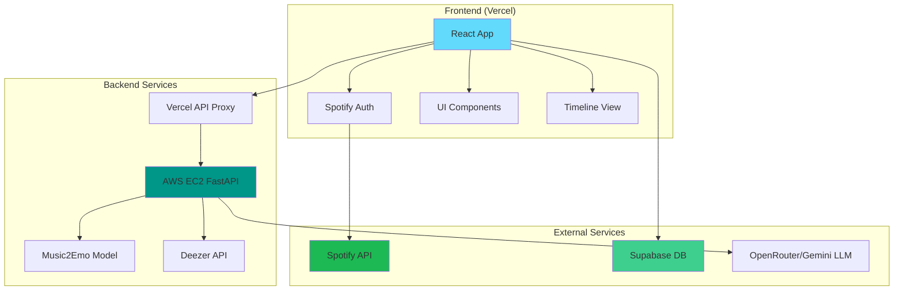
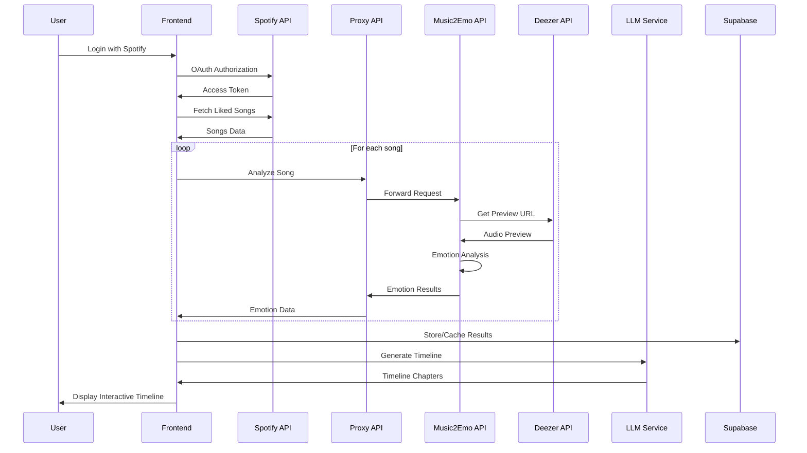

# Vibelines - Technical Documentation

<div align="center">
  
  <h1>Vibelines Technical Documentation</h1>
  <p><em>Your soundtrack, your emotions, your timeline.</em></p>
</div>

---

## Table of Contents

1. [Project Overview](#project-overview)
2. [Architecture](#architecture)
3. [Frontend Application](#frontend-application)
4. [Backend Services](#backend-services)
5. [Data Flow](#data-flow)
6. [Development Setup](#development-setup)
7. [API Documentation](#api-documentation)
8. [Component Library](#component-library)
9. [Deployment](#deployment)
10. [Configuration](#configuration)
11. [Testing](#testing)
12. [Contributing](#contributing)

---

## Project Overview

### Purpose
Vibelines transforms Spotify liked songs into an emotional journey by analyzing music sentiment and creating beautiful, interactive timelines that visualize the mood evolution of a user's musical taste.

### Key Features
- **Spotify Integration**: OAuth authentication and liked songs analysis
- **Music Emotion Recognition**: AI-powered mood analysis using Music2Emo model
- **Interactive Timeline**: Swipeable cards showing musical chapters
- **Social Sharing**: Screenshot capture for social media sharing
- **Responsive Design**: Mobile-first UI with haptic feedback
- **Real-time Processing**: Live music analysis and timeline generation

### Tech Stack Overview
- **Frontend**: React 19, TypeScript, Vite, TailwindCSS
- **Backend**: FastAPI (Python), Music2Emo ML model
- **Database**: Supabase (PostgreSQL)
- **Authentication**: Spotify OAuth 2.0
- **Deployment**: Vercel (Frontend), AWS EC2 (Backend)
- **External APIs**: Spotify Web API, Deezer API, OpenRouter/Gemini

---

## Architecture

### System Architecture



### Data Flow Architecture



---

## Frontend Application

### Project Structure

```
src/
├── components/           # Reusable UI components
│   ├── AuroraBG.tsx     # Animated background
│   ├── BubbleMenu.tsx   # Navigation menu
│   ├── ChapterCard.tsx  # Timeline card component
│   ├── SpotifyCallback.tsx # OAuth callback handler
│   ├── Stack.tsx        # Swipeable card stack
│   ├── TextPressure.tsx # Dynamic text effects
│   └── ui/              # Shadcn/UI components
├── hooks/               # Custom React hooks
│   ├── useScreenSize.ts # Screen dimension tracking
│   └── useScreenshot.ts # Screenshot capture
├── utils/               # Utility functions
│   ├── deezerApi.ts     # Deezer API client
│   ├── emotionApi.ts    # Emotion analysis client
│   ├── spotifyAuth.ts   # Spotify authentication
│   ├── supabaseClient.ts # Database client
│   └── viewTransitions.ts # Page transitions
├── lib/                 # Configuration and helpers
├── App.tsx              # Main application component
├── Loading.tsx          # Data processing page
├── MoodTimeline.tsx     # Timeline visualization
├── About.tsx            # About page
├── Contact.tsx          # Contact page
├── PrivacyPolicy.tsx    # Privacy policy
├── FAQ.tsx              # Frequently asked questions
└── main.tsx             # Application entry point
```

### Key Components

#### 1. App.tsx - Main Application
```typescript
/**
 * Main App component for Vibelines
 * Handles gyroscope permissions, Spotify authentication, and displays the main interface
 */
export default function App() {
  // Gyroscope permission handling for device motion effects
  // Spotify authentication state management
  // Aurora background with interactive text pressure effects
  // Bubble navigation menu
}
```

#### 2. MoodTimeline.tsx - Interactive Timeline
```typescript
/**
 * Interactive timeline display component that renders swipeable cards representing
 * musical chapters with mood analysis. Features audio playback, screenshot capture,
 * and responsive design optimized for mobile and desktop.
 */
export default function MoodTimeline(): React.ReactElement {
  // Card stack management with swipe gestures
  // Audio playback for song previews
  // Screenshot capture for social sharing
  // Responsive card dimensions
}
```

#### 3. Loading.tsx - Data Processing
```typescript
/**
 * Main Loading component that orchestrates the entire Spotify data analysis flow
 * - Spotify authentication callback processing
 * - User profile loading
 * - Liked songs fetching and analysis
 * - Mood analysis via external API
 * - Database operations for caching results
 * - Timeline generation using LLM
 * - Navigation to results page
 */
export default function Loading() {
  // Multi-step data processing pipeline
  // Progress tracking and error handling
  // API rate limiting and retry logic
}
```

### Custom Hooks

#### useScreenshot.ts
Captures screenshots of the timeline for social sharing:
```typescript
interface ScreenshotHook {
  takeScreenshot: () => Promise<void>;
  isCapturing: boolean;
}
```

#### useScreenSize.ts
Tracks screen dimensions for responsive design:
```typescript
interface ScreenSize {
  width: number;
  height: number;
}
```

### State Management
- React hooks for local state
- Context for shared authentication state
- LocalStorage for user preferences
- Supabase for persistent data

---

## Backend Services

### FastAPI Music2Emotion Service

Located in `music2emotion_api/`, this service provides:

#### Core Architecture
```python
class Music2emo:
    """
    Music emotion analysis using the Music2Emo model
    Processes audio files and returns emotion predictions
    """
    def predict(self, audio, threshold=0.5):
        # Audio preprocessing with MERT feature extraction
        # Music2Emo model inference
        # Emotion classification and confidence scoring
```

#### API Endpoints

**Base URL**: `http://104.198.230.255` (AWS EC2)

##### GET `/`
Health check endpoint
```json
{
  "message": "Vibeline's Music2Emotion API",
  "status": "healthy"
}
```

##### POST `/analyze-song`
Analyzes emotional content of a song
```typescript
interface AnalyzeSongRequest {
  song_name: string;
  artist_name: string;
}

interface AnalyzeSongResponse {
  song_name: string;
  artist_name: string;
  emotions: string[];
  confidence_scores: number[];
  preview_url?: string;
}
```

##### GET `/device-info`
Returns server device information
```json
{
  "device_type": "server",
  "gpu_available": boolean,
  "model_loaded": boolean
}
```

### Vercel API Proxy

Located in `api/proxy.js`, handles:
- CORS management for cross-origin requests
- Request forwarding to AWS EC2 backend
- API key management and security
- Error handling and logging

```javascript
export default async function handler(req, res) {
  // CORS configuration
  // Target URL construction
  // Request forwarding with headers
  // Response handling and error management
}
```

---

## Data Flow

### Authentication Flow
1. **Spotify OAuth**: User authorizes Spotify access
2. **Token Management**: Secure token storage and refresh
3. **Profile Fetch**: User profile and permissions validation

### Music Analysis Pipeline
1. **Liked Songs Retrieval**: Fetch user's liked songs from Spotify
2. **Preview URL Lookup**: Search Deezer for song previews
3. **Audio Download**: Temporary audio file processing
4. **Emotion Analysis**: Music2Emo model inference
5. **Result Caching**: Store emotions in Supabase
6. **Timeline Generation**: LLM creates narrative chapters

### Timeline Creation
1. **Data Aggregation**: Group songs by time periods
2. **Emotion Clustering**: Identify mood patterns
3. **Chapter Generation**: LLM creates narrative descriptions
4. **Soundtrack Selection**: Representative songs for each chapter
5. **Interactive Presentation**: Swipeable card interface

---

## Development Setup

### Prerequisites
```bash
# Node.js 18+ and npm
node --version  # Should be 18+
npm --version

# Python 3.8+ for backend
python --version  # Should be 3.8+
pip --version

# Git for version control
git --version
```

### Frontend Setup
```bash
# Clone repository
git clone https://github.com/bjh-developer/vibelines.git
cd vibelines

# Install dependencies
npm install

# Environment variables
cp .env.example .env.local
# Configure Spotify, Supabase, and API keys

# Development server
npm run dev
```

### Backend Setup
```bash
# Navigate to backend directory
cd music2emotion_api

# Create virtual environment
python -m venv venv
source venv/bin/activate  # Linux/Mac
# or
venv\Scripts\activate  # Windows

# Install dependencies
pip install -r requirements.txt

# Download ML models (see model documentation)
# Configure environment variables

# Run FastAPI server
python api.py
```

### Environment Variables

#### Frontend (.env.local)
```env
VITE_SPOTIFY_CLIENT_ID=your_spotify_client_id
VITE_SPOTIFY_REDIRECT_URI=http://localhost:3000/callback
VITE_SUPABASE_URL=your_supabase_url
VITE_SUPABASE_ANON_KEY=your_supabase_anon_key
VITE_OPENROUTER_API_KEY=your_openrouter_key
```

#### Backend (.env)
```env
M2E_API_KEY=your_music2emotion_api_key
DEEZER_APP_ID=your_deezer_app_id
```

---

## API Documentation

### Spotify Web API Integration

#### Authentication
```typescript
const initiateSpotifyAuth = (): void => {
  const params = new URLSearchParams({
    response_type: 'code',
    client_id: SPOTIFY_CLIENT_ID,
    scope: 'user-library-read user-read-private user-read-email',
    redirect_uri: REDIRECT_URI,
    state: generateRandomString(16)
  });
  
  window.location.href = `https://accounts.spotify.com/authorize?${params}`;
};
```

#### Data Fetching
```typescript
interface SpotifyTrack {
  id: string;
  name: string;
  artists: Array<{ name: string }>;
  added_at: string;
  preview_url?: string;
}

const fetchLikedSongs = async (limit: number = 50): Promise<SpotifyTrack[]> => {
  // Paginated fetch of user's liked songs
  // Rate limiting and error handling
  // Data transformation and validation
};
```

### Supabase Database Schema

#### Tables

**mood_analysis**
```sql
CREATE TABLE mood_analysis (
  id SERIAL PRIMARY KEY,
  user_id TEXT NOT NULL,
  song_name TEXT NOT NULL,
  artist_name TEXT NOT NULL,
  predicted_moods TEXT[] NOT NULL,
  confidence_scores DECIMAL[] NOT NULL,
  created_at TIMESTAMP DEFAULT NOW()
);
```

**user_timelines**
```sql
CREATE TABLE user_timelines (
  id SERIAL PRIMARY KEY,
  user_id TEXT NOT NULL,
  timeline_data JSONB NOT NULL,
  created_at TIMESTAMP DEFAULT NOW(),
  updated_at TIMESTAMP DEFAULT NOW()
);
```

### OpenRouter/Gemini LLM Integration

#### Timeline Generation Prompt
```typescript
const generateTimeline = async (moodsData: MoodsAndDatesData[]): Promise<TimelineData> => {
  const prompt = `
    Create a personalized musical timeline from mood analysis data.
    Group songs by emotional themes and time periods.
    Generate 3-10 chapters with:
    - Descriptive chapter titles
    - Time period phases
    - Narrative content (<50 words)
    - Representative soundtrack selection
  `;
  
  // LLM API call with structured output
  // JSON parsing and validation
  // Error handling and fallbacks
};
```

---

## Component Library

### UI Components (Shadcn/UI)

#### Button Component
```typescript
interface ButtonProps extends React.ButtonHTMLAttributes<HTMLButtonElement> {
  variant?: 'default' | 'destructive' | 'outline' | 'secondary' | 'ghost' | 'link';
  size?: 'default' | 'sm' | 'lg' | 'icon';
}
```

#### Drawer Component
```typescript
interface DrawerProps {
  children: React.ReactNode;
  open?: boolean;
  onOpenChange?: (open: boolean) => void;
}
```

### Custom Components

#### AuroraBG.tsx - Animated Background
```typescript
interface AuroraProps {
  colorStops: string[];
  blend: number;
  amplitude: number;
  speed: number;
}
```

#### ChapterCard.tsx - Timeline Card
```typescript
interface ChapterCardProps {
  chapter: string;
  phase: string;
  content: string;
  soundtrack: string;
  cardId: number;
  totalCards: number;
  onAudioPlay?: (url: string) => void;
}
```

#### Stack.tsx - Swipeable Cards
```typescript
interface StackProps {
  cards: React.ReactNode[];
  onCardOrderChange?: (newFrontCardId: number) => void;
  frontCardId?: number;
}
```

---

## Deployment

### Frontend Deployment (Vercel)

#### Configuration (vercel.json)
```json
{
  "rewrites": [
    {
      "source": "/api/(.*)",
      "destination": "/api/$1"
    },
    {
      "source": "/(.*)",
      "destination": "/index.html"
    }
  ]
}
```

#### Build Configuration
```bash
# Build command
npm run build

# Output directory
dist/

# Environment variables configured in Vercel dashboard
```

### Backend Deployment (AWS EC2)

#### Server Setup
```bash
# Ubuntu 20.04 LTS
sudo apt update && sudo apt upgrade -y

# Python and dependencies
sudo apt install python3 python3-pip python3-venv -y

# Application setup
git clone repository
cd music2emotion_api
python3 -m venv venv
source venv/bin/activate
pip install -r requirements.txt

# Process management with systemd
sudo systemctl enable vibelines-api
sudo systemctl start vibelines-api
```

#### Nginx Configuration
```nginx
server {
    listen 80;
    server_name your-domain.com;
    
    location / {
        proxy_pass http://127.0.0.1:8000;
        proxy_set_header Host $host;
        proxy_set_header X-Real-IP $remote_addr;
    }
}
```

---

## Configuration

### Build Configuration

#### Vite Configuration (vite.config.ts)
```typescript
export default defineConfig({
  plugins: [react(), tailwindcss()],
  resolve: {
    alias: {
      "@": path.resolve(__dirname, "./src"),
    },
  },
  server: {
    host: '127.0.0.1',
    port: 3000,
    proxy: {
      '/api/deezer': {
        target: 'https://api.deezer.com',
        changeOrigin: true,
        rewrite: (path) => path.replace(/^\/api\/deezer/, ''),
      }
    },
  },
});
```

#### TypeScript Configuration
```json
{
  "compilerOptions": {
    "target": "ES2020",
    "useDefineForClassFields": true,
    "lib": ["ES2020", "DOM", "DOM.Iterable"],
    "module": "ESNext",
    "skipLibCheck": true,
    "moduleResolution": "bundler",
    "allowImportingTsExtensions": true,
    "resolveJsonModule": true,
    "isolatedModules": true,
    "noEmit": true,
    "jsx": "react-jsx",
    "strict": true,
    "noUnusedLocals": true,
    "noUnusedParameters": true,
    "noFallthroughCasesInSwitch": true,
    "baseUrl": ".",
    "paths": {
      "@/*": ["./src/*"]
    }
  }
}
```

#### TailwindCSS Configuration
```javascript
/** @type {import('tailwindcss').Config} */
export default {
  content: [
    "./index.html",
    "./src/**/*.{js,ts,jsx,tsx}",
  ],
  theme: {
    extend: {
      colors: {
        spotify: '#1DB954',
        aurora: {
          primary: '#7CFF67',
          secondary: '#B19EEF',
          accent: '#5227FF',
        }
      },
      animation: {
        'aurora': 'aurora 20s ease-in-out infinite',
        'float': 'float 6s ease-in-out infinite',
      }
    },
  },
  plugins: [],
}
```

---

## Testing

### Frontend Testing Strategy

#### Unit Tests
```typescript
// Component testing with React Testing Library
import { render, screen } from '@testing-library/react';
import { ChapterCard } from './ChapterCard';

describe('ChapterCard', () => {
  it('renders chapter information correctly', () => {
    render(<ChapterCard chapter="Test" phase="2024" content="Test content" soundtrack="Test Song" />);
    expect(screen.getByText('Test')).toBeInTheDocument();
  });
});
```

#### Integration Tests
```typescript
// API integration testing
import { fetchLikedSongs } from './spotifyAuth';

describe('Spotify Integration', () => {
  it('fetches liked songs successfully', async () => {
    const songs = await fetchLikedSongs();
    expect(songs).toHaveLength(50);
    expect(songs[0]).toHaveProperty('name');
  });
});
```

### Backend Testing

#### API Endpoint Tests
```python
import pytest
from fastapi.testclient import TestClient
from api import app

client = TestClient(app)

def test_health_check():
    response = client.get("/")
    assert response.status_code == 200
    assert response.json()["status"] == "healthy"

def test_analyze_song():
    response = client.post("/analyze-song", json={
        "song_name": "Test Song",
        "artist_name": "Test Artist"
    })
    assert response.status_code == 200
    assert "emotions" in response.json()
```

### End-to-End Testing

#### User Journey Tests
```typescript
// Playwright E2E tests
import { test, expect } from '@playwright/test';

test('complete user journey', async ({ page }) => {
  await page.goto('/');
  await page.click('text=Connect Spotify');
  // Mock Spotify OAuth flow
  await page.waitForURL('/loading');
  await page.waitForURL('/moodtimeline');
  await expect(page.locator('.chapter-card')).toBeVisible();
});
```

---

## Contributing

### Development Workflow

#### Branch Strategy
```bash
# Feature development
git checkout -b feature/new-feature
git commit -m "feat: add new feature"
git push origin feature/new-feature

# Bug fixes
git checkout -b fix/bug-description
git commit -m "fix: resolve bug issue"
git push origin fix/bug-description
```

#### Code Standards

#### ESLint Configuration
```javascript
export default [
  {
    files: ['**/*.{js,jsx,ts,tsx}'],
    plugins: {
      react: reactPlugin,
      'react-hooks': reactHooksPlugin,
    },
    rules: {
      'react/react-in-jsx-scope': 'off',
      'react-hooks/rules-of-hooks': 'error',
      'react-hooks/exhaustive-deps': 'warn',
    },
  },
];
```

#### Pre-commit Hooks
```bash
# Install pre-commit
npm install --save-dev husky lint-staged

# Package.json configuration
{
  "husky": {
    "hooks": {
      "pre-commit": "lint-staged"
    }
  },
  "lint-staged": {
    "*.{js,jsx,ts,tsx}": [
      "eslint --fix",
      "prettier --write",
      "git add"
    ]
  }
}
```

### Performance Optimization

#### Frontend Optimizations
- **Code Splitting**: Dynamic imports for route-based splitting
- **Image Optimization**: WebP format with fallbacks
- **Bundle Analysis**: Webpack bundle analyzer integration
- **Caching Strategy**: Service worker for offline support

#### Backend Optimizations
- **Model Caching**: In-memory model loading
- **Connection Pooling**: Database connection optimization
- **Response Caching**: Redis caching for frequent requests
- **Async Processing**: Background task queues

### Security Considerations

#### Frontend Security
```typescript
// Environment variable validation
const validateEnvironment = () => {
  const required = [
    'VITE_SPOTIFY_CLIENT_ID',
    'VITE_SUPABASE_URL',
    'VITE_SUPABASE_ANON_KEY'
  ];
  
  required.forEach(key => {
    if (!import.meta.env[key]) {
      throw new Error(`Missing required environment variable: ${key}`);
    }
  });
};
```

#### Backend Security
```python
# API key validation
from fastapi import HTTPException, Depends
from fastapi.security import HTTPBearer

security = HTTPBearer()

def validate_api_key(credentials: HTTPAuthorizationCredentials = Depends(security)):
    if credentials.credentials != os.getenv("M2E_API_KEY"):
        raise HTTPException(status_code=401, detail="Invalid API key")
    return credentials
```

---

## Monitoring and Analytics

### Frontend Analytics
- **Vercel Analytics**: Page views and performance metrics
- **Speed Insights**: Core Web Vitals monitoring
- **Error Tracking**: Client-side error logging

### Backend Monitoring
- **Health Checks**: Endpoint availability monitoring
- **Performance Metrics**: Response time and throughput
- **Error Logging**: Structured logging with correlation IDs

### Usage Analytics
```typescript
// Custom event tracking
const trackUserAction = (action: string, properties?: Record<string, any>) => {
  if (typeof window !== 'undefined' && window.gtag) {
    window.gtag('event', action, {
      event_category: 'user_interaction',
      ...properties
    });
  }
};
```

---

## Troubleshooting

### Common Issues

#### Build Errors
```bash
# TypeScript compilation errors
npm run build  # Check for type errors
npx tsc --noEmit  # Type checking only

# Dependency conflicts
rm -rf node_modules package-lock.json
npm install
```

#### Runtime Errors
```typescript
// Error boundary implementation
class ErrorBoundary extends React.Component {
  constructor(props) {
    super(props);
    this.state = { hasError: false };
  }

  static getDerivedStateFromError(error) {
    return { hasError: true };
  }

  componentDidCatch(error, errorInfo) {
    console.error('Error caught by boundary:', error, errorInfo);
  }

  render() {
    if (this.state.hasError) {
      return <h1>Something went wrong.</h1>;
    }

    return this.props.children;
  }
}
```

#### API Issues
```python
# Backend debugging
import logging

logging.basicConfig(level=logging.DEBUG)
logger = logging.getLogger(__name__)

@app.middleware("http")
async def log_requests(request: Request, call_next):
    start_time = time.time()
    response = await call_next(request)
    process_time = time.time() - start_time
    logger.info(f"Request: {request.url} - Time: {process_time:.4f}s")
    return response
```

---

## License and Credits

### Open Source Dependencies
- **React**: MIT License
- **TypeScript**: Apache 2.0 License
- **TailwindCSS**: MIT License
- **FastAPI**: MIT License
- **Music2Emo Model**: Academic Research License

### External Services
- **Spotify Web API**: Developer Terms of Service
- **Deezer API**: Developer Agreement
- **Supabase**: Service Terms
- **Vercel**: Platform Terms

### Attribution
- Inspired by [@ayitsphotography's Instagram post](https://www.instagram.com/reel/DLiS7qfSMjM/)
- Music2Emo model by [AMAAI Lab](https://huggingface.co/amaai-lab/music2emo)
- UI components adapted from [Shadcn/UI](https://ui.shadcn.com/)

---

## Appendix

### Database Schema
```sql
-- Complete database schema
-- User profiles, song analysis, timeline data
-- Indexes and constraints
-- Migration scripts
```

### API Rate Limits
- **Spotify API**: 1 request per second per client
- **Deezer API**: 50 requests per 5 seconds
- **OpenRouter**: 20 requests per minute

### Performance Benchmarks
- **Initial Load**: < 2 seconds
- **Timeline Generation**: < 30 seconds for 1000 songs
- **Memory Usage**: < 100MB peak (frontend)
- **API Response Time**: < 500ms average

---

<div align="center">
  <p><strong>Vibelines Technical Documentation</strong></p>
  <p>Version 1.0.0 | Last Updated: January 2025</p>
  <p><a href="https://vibelines.vercel.app">Live Application</a> | <a href="https://github.com/bjh-developer/vibelines">Source Code</a></p>
</div>