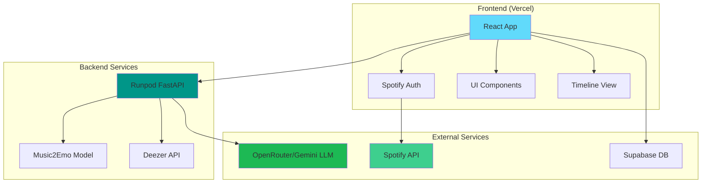
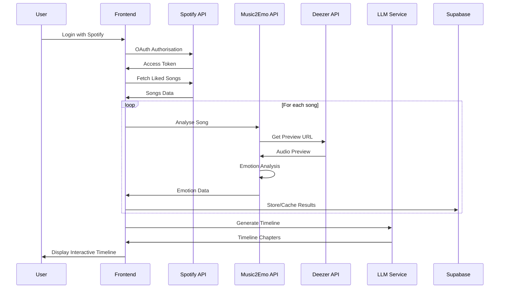

<!-- Vibelines - Technical Documentation -->

<div align="center">
  
  <h1>Vibelines Technical Documentation</h1>
  <p><em>Your soundtrack, your emotions, your timeline.</em></p>
</div>

---

## Table of Contents

1. [Project Overview](#project-overview)
2. [Architecture](#architecture)
3. [Frontend Application](#frontend-application)
4. [Backend Services](#backend-services)
5. [Data Flow](#data-flow)
6. [API Documentation](#api-documentation)
7. [Component Library](#component-library)
8. [Monitoring and Analytics](#monitoring-and-analytics)
9. [License and Credits](#license-and-credits)

---

## Project Overview

### Purpose
Vibelines transforms Spotify liked songs into an emotional journey by analysing music sentiment and creating beautiful, interactive timelines that visualise the mood evolution of a user's musical taste.

### Key Features
- **Spotify Integration**: OAuth authentication and liked songs analysis
- **Music Emotion Recognition**: AI-powered mood analysis using Music2Emo model
- **Interactive Timeline**: Swipeable cards showing musical chapters
- **Social Sharing**: Screenshot capture for social media sharing
- **Responsive Design**: Mobile-first UI with haptic feedback
- **Real-time Processing**: Live music analysis and timeline generation

### Tech Stack Overview
- **Frontend**: React 19, TypeScript, Vite, TailwindCSS
- **Backend**: FastAPI (Python), Music2Emo ML model
- **Database**: Supabase (PostgreSQL)
- **Authentication**: Spotify OAuth 2.0
- **Deployment**: Vercel (Frontend), Runpod (Backend)
- **External APIs**: Spotify Web API, Deezer API, OpenRouter/Gemini

---

## Architecture

### System Architecture



### Data Flow Architecture



---

## Frontend Application

### Project Structure

```
src/
├── components/           # Reusable UI components
│   ├── AuroraBG.tsx     # Animated background
│   ├── BubbleMenu.tsx   # Navigation menu
│   ├── ChapterCard.tsx  # Timeline card component
│   ├── SpotifyCallback.tsx # OAuth callback handler
│   ├── Stack.tsx        # Swipeable card stack
│   ├── TextPressure.tsx # Dynamic text effects
│   └── ui/              # Shadcn/UI components
├── hooks/               # Custom React hooks
│   ├── useScreenSize.ts # Screen dimension tracking
│   └── useScreenshot.ts # Screenshot capture
├── utils/               # Utility functions
│   ├── deezerApi.ts     # Deezer API client
│   ├── emotionApi.ts    # Emotion analysis client
│   ├── spotifyAuth.ts   # Spotify authentication
│   ├── supabaseClient.ts # Database client
│   └── viewTransitions.ts # Page transitions
├── lib/                 # Configuration and helpers
├── App.tsx              # Main application component
├── Loading.tsx          # Data processing page
├── MoodTimeline.tsx     # Timeline visualization
├── About.tsx            # About page
├── Contact.tsx          # Contact page
├── PrivacyPolicy.tsx    # Privacy policy
├── FAQ.tsx              # Frequently asked questions
└── main.tsx             # Application entry point
```

### Key Components

#### 1. App.tsx - Main Application
```typescript
/**
 * Main App component for Vibelines
 * Handles gyroscope permissions, Spotify authentication, and displays the main interface
 */
export default function App() {
  // Gyroscope permission handling for device motion effects
  // Spotify authentication state management
  // Aurora background with interactive text pressure effects
  // Bubble navigation menu
}
```

#### 2. MoodTimeline.tsx - Interactive Timeline
```typescript
/**
 * Interactive timeline display component that renders swipeable cards representing
 * musical chapters with mood analysis. Features audio playback, screenshot capture,
 * and responsive design optimised for mobile and desktop.
 */
export default function MoodTimeline(): React.ReactElement {
  // Card stack management with swipe gestures
  // Audio playback for song previews
  // Screenshot capture for social sharing
  // Responsive card dimensions
}
```

#### 3. Loading.tsx - Data Processing
```typescript
/**
 * Main Loading component that orchestrates the entire Spotify data analysis flow
 * - Spotify authentication callback processing
 * - User profile loading
 * - Liked songs fetching and analysis
 * - Mood analysis via external API
 * - Database operations for caching results
 * - Timeline generation using LLM
 * - Navigation to results page
 */
export default function Loading() {
  // Multi-step data processing pipeline
  // Progress tracking and error handling
  // API rate limiting and retry logic
}
```

### Custom Hooks

#### useScreenshot.ts
Captures screenshots of the timeline for social sharing:
```typescript
interface ScreenshotHook {
  takeScreenshot: () => Promise<void>;
  isCapturing: boolean;
}
```

#### useScreenSize.ts
Tracks screen dimensions for responsive design:
```typescript
interface ScreenSize {
  width: number;
  height: number;
}
```

### State Management
- React hooks for local state
- Context for shared authentication state
- LocalStorage for user preferences
- Supabase for persistent data

---

## Backend Services

### FastAPI Music2Emotion Service

Located in `music2emotion_api/`, this service provides:

#### Core Architecture
[Refer here](https://huggingface.co/amaai-lab/music2emo) for official write-up and credits.

#### API Endpoints

##### GET `/`
Health check endpoint
```json
{
    "message": "Vibeline's Music2Emotion API is running", 
    "status": "healthy"
}
```

##### POST `/analyse&predict/{song_title}/{artist_name}`
Analyse and predict emotions for a given song
```json
{"predicted_moods": cleaned_predicted_moods}
```

##### GET `/device-info`
Get information about the server device and model status.
```json
{
    "cuda_available": Boolean,
    "mps_available": Boolean,
    "device_count": Integer,
}
```

---

## Data Flow

### Authentication Flow
1. **Spotify OAuth**: User authorizes Spotify access
2. **Token Management**: Secure token storage and refresh
3. **Profile Fetch**: User profile and permissions validation

### Music Analysis Pipeline
1. **Liked Songs Retrieval**: Fetch user's liked songs from Spotify
2. **Preview URL Lookup**: Search Deezer for song previews
3. **Audio Download**: Temporary audio file processing
4. **Emotion Analysis**: Music2Emo model inference
5. **Result Caching**: Store emotions in Supabase
6. **Timeline Generation**: LLM creates narrative chapters
*If the song exists in the Supabase database, the song will not go through emotion analysis again to improve efficiency.*

### Timeline Creation
1. **Data Aggregation**: Group songs by time periods
2. **Emotion Clustering**: Identify mood patterns
3. **Chapter Generation**: LLM creates narrative descriptions
4. **Soundtrack Selection**: Representative songs for each chapter
5. **Interactive Presentation**: Swipeable card interface

---

## API Documentation

### Spotify Web API Integration

#### Authentication
```typescript
const initiateSpotifyAuth = (): void => {
  const params = new URLSearchParams({
    response_type: 'code',
    client_id: SPOTIFY_CLIENT_ID,
    scope: 'user-library-read user-read-private user-read-email',
    redirect_uri: REDIRECT_URI,
    state: generateRandomString(16)
  });
  
  window.location.href = `https://accounts.spotify.com/authorize?${params}`;
};
```

#### Data Fetching
```typescript
interface SpotifyTrack {
  id: string;
  name: string;
  artists: Array<{ name: string }>;
  added_at: string;
  preview_url?: string;
}

const fetchLikedSongs = async (limit: number = 50): Promise<SpotifyTrack[]> => {
  // Paginated fetch of the user's liked songs
  // Rate limiting and error handling
  // Data transformation and validation
};
```

### Supabase Database Schema

#### Table

**song_mood_analysis**
```sql
CREATE TABLE song_mood_analysis (
  id SERIAL PRIMARY KEY,
  song_title TEXT NOT NULL,
  artist_name TEXT NOT NULL,
  album_name TEXT,
  -- Normalized identifiers for matching across platforms
  song_title_normalized TEXT NOT NULL, -- Lowercase, no special chars
  artist_name_normalized TEXT NOT NULL, -- Lowercase, no special chars
  predicted_moods TEXT[] NOT NULL, -- Array of mood labels
  created_at TIMESTAMP WITH TIME ZONE DEFAULT NOW(),
  updated_at TIMESTAMP WITH TIME ZONE DEFAULT NOW()
);
```

### OpenRouter/Gemini LLM Integration

#### Timeline Generation Prompt
```typescript
const generateTimeline = async (moodsData: MoodsAndDatesData[]): Promise<TimelineData> => {
  const prompt = `Based on the following chronological list of moods of songs a listener has liked, analyze their emotional journey and create a compelling, music-therapy-style narrative timeline of their musical vibes:

${moodsDataString}

Instructions:
Step 1: Analyze the moods data for each year individually (ONLY USE THE DATA PROVIDED IN THE LIST ABOVE). Identify dominant emotions, mood shifts, and seasonal changes within that year.
Step 2: Based on this analysis, split each year into chapters so that:
  - Every year is represented by 1-3 chapters.
  - Chapters reflect clear emotional shifts within the year.
  - No chapter spans more than 12 months unless data is sparse.
Step 3: Ensure chapters are ordered chronologically.
Step 4: For each chapter:
  - Give a creative, metaphorical title.
  - Provide an approximate date range (DO NOT include date ranges that does not exist from data).
  - Write a vivid narrative (<50 words) in second person, describing dominant emotions, transitions, and growth.
  - Highlight seasonal/temporal shifts.
  - Select a fitting soundtrack from the provided songs in that period.
Step 5: The JSON example below is only a formatting template:
  - Do NOT reuse or copy its chapter titles, phases, contents, or soundtracks.
  - Only follow the structure, keys, and formatting style.
  - All values (Chapters, Phases, Contents, Soundtracks) must come from the provided moods data.

* Make sure the number of chapters, phases, contents, and soundtracks are ALL THE SAME (e.g. 10 chapters = 10 phases = 10 contents = 10 soundtracks), phases should only be up to the latest date given in the list above.

Return ONLY valid JSON, following this format/example:
{"Chapters": {"1": "The Echoes of Love and Longing","2": "Embracing the Upbeat","3": "Unveiling Inner Strength"},"Phases": {"1": "(March - April 2018)","2": "(April - July 2018)","3": "(August 2018 - January 2019)"},"Contents": {"1": "You begin in a space of tender reflection, where love's sweetness intertwines with a gentle ache.","2": "The tempo remains elevated, celebrating life's bright moments.","3": "A powerful undercurrent surfaces, marked by anthems of resilience and introspection."},"Soundtracks": {"1": "\\"When I Was Your Man\\" by Bruno Mars","2": "\\"Perfect Strangers\\" by Jonas Blue, JP Cooper","3": "\\"Thunder\\" by Imagine Dragons"}}`;
  
  // LLM API call with structured output
  // JSON parsing and validation
  // Error handling and fallbacks
};
```

---

## Component Library

### UI Components (Shadcn/UI)

#### Button Component
```typescript
interface ButtonProps extends React.ButtonHTMLAttributes<HTMLButtonElement> {
  variant?: 'default' | 'destructive' | 'outline' | 'secondary' | 'ghost' | 'link';
  size?: 'default' | 'sm' | 'lg' | 'icon';
}
```

#### Drawer Component
```typescript
interface DrawerProps {
  children: React.ReactNode;
  open?: boolean;
  onOpenChange?: (open: boolean) => void;
}
```

### Custom Components

#### AuroraBG.tsx - Animated Background
```typescript
interface AuroraProps {
  colorStops: string[];
  blend: number;
  amplitude: number;
  speed: number;
}
```

#### ChapterCard.tsx - Timeline Card
```typescript
interface ChapterCardProps {
  chapter: string;
  phase: string;
  content: string;
  soundtrack: string;
  cardId: number;
  totalCards: number;
  onAudioPlay?: (url: string) => void;
}
```

#### Stack.tsx - Swipeable Cards
```typescript
interface StackProps {
  cards: React.ReactNode[];
  onCardOrderChange?: (newFrontCardId: number) => void;
  frontCardId?: number;
}
```

---

## Monitoring and Analytics

### Frontend Analytics
- **Vercel Analytics**: Page views and performance metrics
- **Speed Insights**: Core Web Vitals monitoring
- **Error Tracking**: Client-side error logging

---

## License and Credits

### Open Source Dependencies
- **React**: MIT License
- **TypeScript**: Apache 2.0 License
- **TailwindCSS**: MIT License
- **FastAPI**: MIT License
- **Music2Emo Model**: Academic Research License

### External Services
- **Spotify Web API**: Developer Terms of Service
- **Deezer API**: Developer Agreement
- **Supabase**: Service Terms
- **Vercel**: Platform Terms

### Attribution
- Inspired by [@ayitsphotography's Instagram post](https://www.instagram.com/reel/DLiS7qfSMjM/)
- Music2Emo model by [AMAAI Lab](https://huggingface.co/amaai-lab/music2emo)
- UI components adapted from [Shadcn/UI](https://ui.shadcn.com/)

---

<div align="center">
  <p><strong>Vibelines Technical Documentation</strong></p>
  <p>Version 1.0.0 | Last Updated: September 2025</p>
  <p><a href="https://vibelines.vercel.app">Live Application</a> | <a href="https://github.com/bjh-developer/vibelines">Source Code</a></p>
</div>
